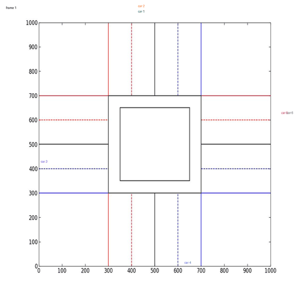
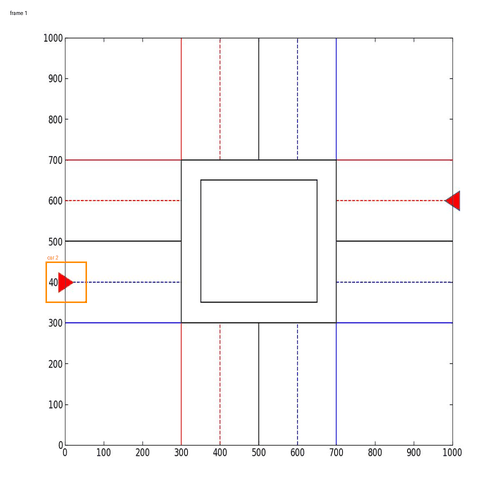

# Intersection Traffic Simulation with Particle-Filter Vehicle Tracking

Simulation of cars crossing a four-way intersection, with a **particle filter + mean-shift**
tracker that follows the cars in a rendered camera image. Python port of the MATLAB code of my
master's thesis, *Automatic Intersection Control for Autonomous Vehicles Using Particle Filter*
(Hamedan University of Technology).

Author: Hadis Beiranvand

**Six cars of the thesis (Table 4-1): junction control**



**Two cars with the tracker's boxes** (optional `--robust-tracker` settings, see "Tracker reliability")



*Cars start outside the picture and brake, wait, cross and turn according to the junction logic.
The six-car GIF shows the simulation only: with several cars that look the same, the histogram
tracker often follows the wrong car (in my run the tracker box was more than 40 px off in 43% of
the car-frames), so its boxes are not drawn there.*

## Background
This project is based on my master's thesis *Automatic Intersection Control for Autonomous
Vehicles Using Particle Filter* (M.Sc. Electrical Engineering - Control, Hamedan University of
Technology), defended on 3 March 2021 (13 Esfand 1399). In the thesis I built, in MATLAB, a
simulated four-way intersection where autonomous cars use their speed, acceleration and direction
to brake, wait, cross and turn, together with a particle-filter vehicle tracker that follows the
cars in a rendered camera image. The MATLAB code was finished in February 2021 (see `matlab/`).

In 2026 I ported the code to Python. The port reproduces the original car trajectories exactly
(verified against a saved MATLAB run). I also analysed why the original tracker sometimes loses
a car and added an optional, more robust variant.

## What it does
- **Simulation and junction logic:** cars with start position, speed, acceleration and goal
  direction; they brake behind other cars, wait for free space in the junction, cross, and turn
  or U-turn (`controller.py`).
- **Camera image:** the scene is rendered like a picture (`render.py`).
- **Tracking:** each car is tracked with a colour-histogram model (Epanechnikov kernel,
  Bhattacharyya distance), a particle filter with resampling, then mean-shift refinement and an
  edge-based update of the window size (`tracker.py`).

## Quick start
```bash
pip install -r requirements.txt
python -m traffic_pf.simulate --seed 0 --save-frames     # example with 2 cars
```
Plots, `results.npz` and (optionally) the frames go to `output/`.

Other options:
```bash
python -m traffic_pf.simulate --scenario my.json     # your own cars
python -m traffic_pf.simulate --interactive          # type the cars in
python -m traffic_pf.simulate --robust-tracker       # see "Tracker reliability"
python -m traffic_pf.simulate --scenario examples/thesis_table_4_1.json   # the 6 cars of the thesis (Table 4-1)
python -m traffic_pf.simulate --fix-braking          # optional, see "Note on cars that start at rest"
python examples/make_demo_gif.py thesis_table_4_1.json demo_6cars nobox   # regenerate the GIFs in docs/
```
A scenario is a JSON list of cars: `street` (1-4, initial heading), `position` (0-500),
`goal_street` (1-4), `acceleration` (0-5), `speed` (0-10), `size` (0-5); see
`examples/two_cars.json`.

## Project layout
| MATLAB (`matlab/`) | Python |
|---|---|
| `myfilter.m` | `traffic_pf/simulate.py` |
| `inputcar.m`, `sakht.m` | `traffic_pf/car.py` |
| `controler.m`, `Ai.m`, `check*.m` | `traffic_pf/controller.py` |
| `filter2.m`, `Epac.m`, `P.m`/`Q.m`, `distance.m`, `Weight*.m`, `Iteration1.m` | `traffic_pf/tracker.py` |
| `plotBGIMAGE.m` | `traffic_pf/render.py` |

## Verification
The simulation and junction logic are deterministic. `tests/test_against_matlab.py` checks that
the Python version reproduces the car trajectories saved by the original MATLAB run exactly
(`matlab/example_output/inf.mat`):
```bash
python tests/test_against_matlab.py
```
The tracker is random (as in the original), so only its behaviour can be compared, not exact numbers.

**Six-car scenario of the thesis (Table 4-1, `examples/thesis_table_4_1.json`).** All six cars
cross the junction in 52 frames, with no collisions after the first frames (cars 1 and 2 start only 23 units apart, as in the table) (the thesis reports about 50), and frame 4 looks like
Fig. 4-15. The table values were used as given (the table has no car size, 5 is assumed); the exact
inputs typed for the thesis figures are not known, so later frames are not compared one to one.

## Tracker reliability
With the original settings the tracker sometimes loses a car: the tracking window shrinks to
about 20 px, and the particle cloud (std about 20 px) cannot follow the 80-unit jump a car makes
when it enters the junction. The saved MATLAB run shows the same drift (30-65 px error).

`--robust-tracker` keeps the window fixed and widens the cloud. This is **my later change and is
not part of the thesis code**. In 10 test runs per car (2-car example) it lost no car and had a
median error of about 8 px. The junction logic uses the simulated positions, not the tracker's
estimate, so car trajectories are the same in both modes.

## Note on cars that start at rest
In the original logic (`Ai.m`) a car that starts with speed 0 heading 2 or 4 does not start moving
(headings 1 and 3 do). The thesis scenarios are not affected. `--fix-braking` makes it symmetric
(my change, not in the thesis code); it gives identical results on the 2-car run and the 6-car scenario.

## Porting notes
- State lives in `Car` / `World` objects instead of being saved to `inf.mat` after every call.
- As far as I can tell from reading `myfilter.m`, the variable `info` is never reloaded inside the
  loop, so its stop condition and final plots would read stale data. The Python loop simply stops when
  all cars have crossed and left.
- `filter2.m` has the same name as a MATLAB built-in; here it is `track_car`.
- The first-frame jump test in `controler.m` compared with an empty value (or a leftover `global`);
  it is skipped on a car's first frame.
- Tested with Python 3.12.
- Kept as in the original (probable typo, marked in the code): the width test
  `(WWWt<50)&&(WWWt<7)` in the tracker.
- Exact comparison with MATLAB output was possible for the 2-car run (see Verification).

## License
MIT, see `LICENSE`.
